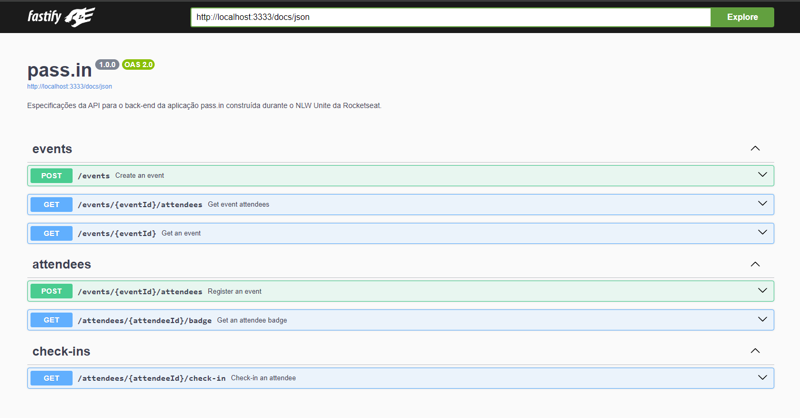

<h1 align="center"> pass.in | NLW Unite NodeJS </h1>

<p align="center">
API REST desenvolvida através do NLW Unite, <strong>trilha de NodeJS</strong> da Rocketseat<br/>
</p>

<p align="center">
  <a href="#-tecnologias">Tecnologias</a>&nbsp;&nbsp;&nbsp;|&nbsp;&nbsp;&nbsp;
  <a href="#-projeto">Projeto</a>&nbsp;&nbsp;&nbsp;|&nbsp;&nbsp;&nbsp;
  <a href="#-licença">Licença</a>
</p>

<p align="center">
  
</p>

## ⚙ Utilização

**1. Clone o repositório:**

```bash
git clone https://github.com/RafaelR4mos/nlw-unite-pass-in.git
```

**2. Instale as dependências:**

```
npm install
```

**3. Execute as migrations:**

```
npm run db:migrate
```

**4. Execute o servidor de desenvolvimento:**

```bash
npm run dev
```

**OPCIONAL: Você pode verificar as inserções no bd local com o comando:**

```bash
npm run db:studio
```

## 🚀 Tecnologias

Esse projeto foi desenvolvido com as tecnologias:


- Zod

## 💻 Projeto

O projeto é uma API REST. Como requisitos funcionais, não funcionais e regras de negócios, da aplicação, temos:

### Requisitos funcionais

- [x] O organizador deve poder cadastrar um novo evento;
- [x] O organizador deve poder visualizar dados de um evento;
- [x] O organizador deve poder visualizar a lista de participantes;
- [x] O participante deve poder se inscrever em um evento;
- [x] O participante deve poder visualizar seu crachá de inscrição;
- [x] o participante deve poder reealizar check-in no evento;

### Regras de negócio

- [x] O participante só pode se inscrever em um evento uma única vez;
- [x] O participante só pode se inscrever em eventos com vagas disponíveis;
- [x] O participante só pode realizar check-in em um evento uma única vez;

### Requisitos não-funcionais

- [x] O check-in no evento será realizado através de um QRCode;

## 🔘 Licença

Esse projeto está sob a licença MIT.

---

Feito por: Rafael Ramos 💙
